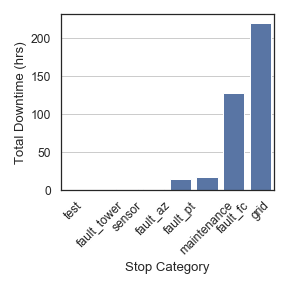

Overview
========

The three main parts of the package are the :mod:`wtphm.batch`, and
:mod:`wtphm.pred_processing` modules, as well as the
:mod:`wtphm.clustering` subpackage.

:mod:`wtphm.batch` contains the functions for creating the batches of
turbine alarms and assigning a high-level reason for the stoppage, gleaned from
the events and scada data. More information on this can be found in [1]_.

:mod:`wtphm.pred_processing` contains functions for labelling SCADA data based
on the batches, for purposes of fault detection or prognosis.

:mod:`wtphm.clustering` deals with clustering together different similar
alarm sequences, explored in [2]_. This part of the library isn't updated as much
as the others - development may be needed in some parts.

Information and critiques on some of the issues surrounding the data coming from
wind turbines more generally can be found in [3]_.

Input Data Needed for Batch Creation
====================================
Batches are groups of turbine events
generated by the alarm system which appear during a stoppage.
The data to be used for creating the batches and assigning a high level cause
for the stop must have certain features, described here.

Events Data
-----------

.. include:: ../README.rst
   :start-after: start event comment
   :end-before: end event comment

SCADA Data
----------

.. include:: ../README.rst
   :start-after: start scada comment
   :end-before: end scada comment

Sample Data
-----------
There is sample data provided in the
`examples <https://github.com/lkev/wtphm/tree/master/examples>`_ folder of the
github repository. This is 2 months' of real data for 2 turbines,
but has been fully anonymised. For the ``event_data``, all codes have been
mapped to a random set of numbers, and descriptions have been removed.
For the ``scada_data``, all values have been normalised between 0 and 1,
with the exception of the availability counters ("lot",
"rt", etc.) and features counting the number and duration of alarms in the
past 48 hours, "num_48h" and "dur_48h").

The data can be imported like so:

>>> import wtphm
>>> import pandas as pd
>>> event_data = pd.read_csv('examples/event_data.csv',
...                          parse_dates=['time_on', 'time_off'])
>>> event_data.duration = pd.to_timedelta(event_data.duration)
>>> scada_data  = pd.read_csv('examples/scada_data.csv',
...                           parse_dates=['time'])

>>> event_data.head()
   turbine_num  code             time_on            time_off        duration  stop_cat             description
0           22     9 2015-11-01 00:03:56 2015-11-01 00:23:56 0 days 00:20:00        ok  description anonymised
1           21    93 2015-11-01 00:09:54 2015-11-01 00:10:56 0 days 00:01:02        ok  description anonymised
2           21    97 2015-11-01 00:10:56 2015-11-01 00:37:39 0 days 00:26:43        ok  description anonymised
3           22   165 2015-11-01 00:16:39 2015-11-06 05:03:35 5 days 04:46:56        ok  description anonymised
4           22    93 2015-11-01 00:23:56 2015-11-01 00:24:58 0 days 00:01:02        ok  description anonymised

>>> scada_data.head()
                time  turbine_num  wind_speed        kw  wind_speed_sd  wind_speed_max  ...  lot  wot  est   mt   rt  eect
0 2015-11-01 00:00:00           22    0.148473  0.009655       0.064693        0.110283  ...  0.0  0.0  0.0  0.0  0.0   0.0
1 2015-11-01 00:10:00           22    0.125081  0.004962       0.066886        0.084016  ...  0.0  0.0  0.0  0.0  0.0   0.0
2 2015-11-01 00:20:00           22    0.121183  0.004913       0.060307        0.086624  ...  0.0  0.0  0.0  0.0  0.0   0.0
3 2015-11-01 00:30:00           22    0.137752  0.004454       0.067982        0.104322  ...  0.0  0.0  0.0  0.0  0.0   0.0
4 2015-11-01 00:40:00           22    0.171540  0.040889       0.066886        0.113077  ...  0.0  0.0  0.0  0.0  0.0   0.0
[5 rows x 22 columns]

.. _ug_grouped_data:

Group Faults of the Same Type
=============================

Sometimes it is useful to treat similar types of fault together
as the same type of fault.
An example would be faults across different pitch motors on different
turbine blades being grouped as the same type of fault. This is useful, as
there are typically *very* few fault samples on wind turbines, so treating
these as three separate types of faults would give even fewer samples for
each class.

The :func:`wtphm.batch.get_grouped_event_data` function does this.
For the pitch fault example above, the grouping would give the events "pitch
thyristor 1 fault" with code 501,
"pitch thyristor 2 fault" with code 502 and "pitch thyristor 3 fault"
with code 503 all the same event description and code, i.e. they all
become "pitch thyristor 1/2/3 fault (original codes 501/502/503)" with
code 501. Note that this is an entirely optional step before creating the
batches of events.

>>> # codes that cause the turbine to come to a stop
... stop_codes = event_data[
...     (event_data.stop_cat.isin(['maintenance', 'test', 'sensor', 'grid'])) |
...     (event_data.stop_cat.str.contains('fault'))].code.unique()
>>> # each of these lists represents a set of pitch-related events, where
... # each memeber of the set represents the same event but along a
... # different blade axis
... pitch_code_groups = [[300, 301, 302], [400, 401], [500, 501, 502],
...                      [600, 601], [700, 701, 702]]
>>> event_data[event_data.code.isin(
...     [i for s in pitch_code_groups for i in s])].head()
     turbine_num  code             time_on            time_off duration  stop_cat                          description
112           22   502 2015-11-01 21:04:26 2015-11-01 21:04:36 00:00:10  fault_pt  description anonymised pitch axis 3
114           22   601 2015-11-01 21:04:28 2015-11-01 21:04:36 00:00:08  fault_pt  description anonymised pitch axis 2
119           22   601 2015-11-01 21:04:36 2015-11-01 21:04:36 00:00:00  fault_pt  description anonymised pitch axis 2
131           22   600 2015-11-01 21:04:36 2015-11-01 21:04:36 00:00:00  fault_pt  description anonymised pitch axis 1
132           22   600 2015-11-01 21:04:36 2015-11-01 21:04:36 00:00:00  fault_pt  description anonymised pitch axis 1

As can be seen, the events data has a number of different codes for data
along different pitch axes.

Below, we group these together as the same code (note the descriptions
have been anonymised):

>>> event_data, stop_codes = wtphm.batch.get_grouped_event_data(
...     event_data=event_data, code_groups=pitch_code_groups,
...     fault_codes=stop_codes)
>>> # viewing the now-grouped events from above:
... event_data.loc[[112, 114, 119, 131, 132]]
     turbine_num  code             time_on            time_off duration  stop_cat                                                           description
112           22   500 2015-11-01 21:04:26 2015-11-01 21:04:36 00:00:10  fault_pt  description anonymised pitch axis 1/2/3 (original codes 500/501/502)
114           22   600 2015-11-01 21:04:28 2015-11-01 21:04:36 00:00:08  fault_pt        description anonymised pitch axis 1/2 (original codes 600/601)
119           22   600 2015-11-01 21:04:36 2015-11-01 21:04:36 00:00:00  fault_pt        description anonymised pitch axis 1/2 (original codes 600/601)
131           22   600 2015-11-01 21:04:36 2015-11-01 21:04:36 00:00:00  fault_pt        description anonymised pitch axis 1/2 (original codes 600/601)
132           22   600 2015-11-01 21:04:36 2015-11-01 21:04:36 00:00:00  fault_pt        description anonymised pitch axis 1/2 (original codes 600/601)

.. _create_batches:

Creating Batches
================

As mentioned in [4]_, turbine alarms often occur in "showers" which can
overwhelm operators and make it difficult to pinpoint the root cause of a
stoppage.
:func:`wtphm.batch.get_batch_data` creates the batches. The algorithm is as
follows, as described in detail in [1]_:

* A list of event codes which causes the turbine to stop, ``fault_codes``,
  are passed to the function, as well as the code which signifies the turbine
  returning to normal operation after downtime, ``ok_code``.
* The earliest event in the ``event_data`` which matches a code in
  ``fault_codes`` is gotten. Every event between then and the next
  earliest ``ok_code`` event are stored as a batch.
* The next earliest event in ``event_data`` which matches a code in
  ``fault_codes`` is gotten. Every event between then and the next
  earliest ``ok_code`` event are stored as a batch, etc.

>>> # create the batches
... batch_data = wtphm.batch.get_batch_data(
...     event_data=event_data, fault_codes=stop_codes, ok_code=207,
...     t_sep_lim='1 hours')
>>> batch_data.loc[15:20]
    turbine_num   fault_root_codes     all_root_codes         start_time  ... fault_dur down_dur    fault_event_ids      all_event_ids
15           22     (68, 113, 500)     (68, 113, 500) 2015-12-03 12:1...  ...  00:03:20 00:07:25  Int64Index([29...  Int64Index([29...
16           22         (144, 500)         (144, 500) 2015-12-08 16:3...  ...  00:11:50 00:15:55  Int64Index([32...  Int64Index([32...
17           22              (73,)          (73, 141) 2015-12-10 18:1...  ...  00:00:00 00:00:17  Int64Index([33...  Int64Index([33...
18           22      (77, 85, 164)      (77, 85, 164) 2015-12-11 10:0...  ...  03:03:14 03:07:25  Int64Index([34...  Int64Index([34...
19           22      (77, 85, 164)      (77, 85, 164) 2015-12-14 12:3...  ...  09:52:49 09:52:51  Int64Index([36...  Int64Index([36...
20           22  (68, 113, 144,...  (68, 113, 144,... 2015-12-16 10:0...  ...  01:09:01 01:09:02  Int64Index([38...  Int64Index([38...
[6 rows x 10 columns]

Note that if two stoppages occur in quick succession, i.e. one batch ends and
another quickly begins, the ``t_sep_lim`` argument in
:func:`wtphm.batch.get_batch_data` allows us to treat both as the same
continuous batch. For more information about the various columns and parameters,
see the :func:`wtphm.batch.get_batch_data` documentation.

Below, we view one of the batches and the event behind it in a bit more detail:

>>> batch_data.loc[20]
turbine_num                               22
fault_root_codes         (68, 113, 144, 500)
all_root_codes           (68, 113, 144, 500)
start_time               2015-12-16 10:00:05
fault_end_time           2015-12-16 11:09:06
down_end_time            2015-12-16 11:09:07
fault_dur                    0 days 01:09:01
down_dur                     0 days 01:09:02
fault_event_ids     Int64Index([3868, 386...
all_event_ids       Int64Index([3868, 386...
Name: 20, dtype: object
>>> event_data.loc[batch_data.loc[20, 'all_event_ids']].head()
      turbine_num  code             time_on            time_off duration  stop_cat                                                           description
3868           22   144 2015-12-16 10:00:05 2015-12-16 10:00:13 00:00:08  fault_pt                                                description anonymised
3867           22    68 2015-12-16 10:00:05 2015-12-16 10:00:13 00:00:08  fault_pt                                                description anonymised
3866           22   500 2015-12-16 10:00:05 2015-12-16 10:00:13 00:00:08  fault_pt  description anonymised pitch axis 1/2/3 (original codes 500/501/502)
3865           22   113 2015-12-16 10:00:05 2015-12-16 10:00:13 00:00:08  fault_pt                                                description anonymised
3869           22   300 2015-12-16 10:00:10 2015-12-16 10:00:13 00:00:03  fault_pt  description anonymised pitch axis 1/2/3 (original codes 300/301/302)

We can also see the corresponding SCADA data. Note that the down-time counter,
'dt', which count the number of seconds in each 10-minute period the turbine was
down, is active after the start time of the batch, and goes back to zero after
it reactivates.

>>> start = batch_data.loc[20, 'start_time'] - pd.Timedelta('20 minutes')
>>> end = batch_data.loc[20, 'down_end_time'] + pd.Timedelta('20 minutes')
>>> t = batch_data.loc[20, 'turbine_num']
>>> scada_data.loc[
...     (scada_data.time >= start) & (scada_data.time <= end) &
...     (scada_data.turbine_num == t),
...     ['time', 'turbine_num', 'wind_speed', 'kw', 'ot', 'sot', 'dt']]
                    time  turbine_num  wind_speed        kw     ot    sot     dt
6425 2015-12-16 09:50:00           22    0.245289  0.298111  600.0  600.0    0.0
6426 2015-12-16 10:00:00           22    0.281027  0.454494  600.0  600.0    0.0
6427 2015-12-16 10:10:00           22    0.263158  0.016645   11.0    6.0  594.0
6428 2015-12-16 10:20:00           22    0.226446  0.005421    0.0    0.0  600.0
6429 2015-12-16 10:30:00           22    0.217674  0.004993    0.0    0.0  600.0
6430 2015-12-16 10:40:00           22    0.195257  0.004906    0.0    0.0  600.0
6431 2015-12-16 10:50:00           22    0.179337  0.005240    0.0    0.0  600.0
6432 2015-12-16 11:00:00           22    0.234243  0.004948    0.0    0.0  600.0
6433 2015-12-16 11:10:00           22    0.246589  0.005344    0.0   53.0  547.0
6434 2015-12-16 11:20:00           22    0.258285  0.285964  355.0  600.0    0.0

Assigning High-Level Root Causes to Stoppages
=============================================
Once the batches have been obtained, the ``event_data`` and ``scada_data``
can be used to assign a "stop category" to the batch. Here the "stop category"
refers to a functional location on the turbine using some pre-determined
taxonomy, or that the turbine was down due to grid issues, testing, maintenance,
etc.

This library provides a family of functions that use two main sources of
information to get the stop categories: the "root" events of a batch, and the
SCADA data availability counters.

Using the root events
---------------------

The root events refer to the event(s) that occur at the start of the batch, and
are stored as ``fault_root_codes`` in the ``event_data``. Since these are the
events that initially cause the turbine to stop, the ``stop_cat`` of
these events are used to assign a ``stop_cat`` to the batch, i.e. the entire
stoppage, as a whole.

To get the ``root_cats``, use the :func:`wtphm.batch.get_root_cats` function:

>>> root_cats = wtphm.batch.get_root_cats(batch_data, event_data)
>>> root_cats.loc[15:20]
15              (fault_pt, fault_pt, fault_pt)
16                        (fault_pt, fault_pt)
17                                   (sensor,)
18                      (grid, grid, fault_pt)
19                      (grid, grid, fault_pt)
20    (fault_pt, fault_pt, fault_pt, fault_pt)

The names of the categories in ``root_cats`` come from the ``stop_cat`` of the
events from which they are made. Here, "fault_pt" refers to a pitch fault.

From here, we can assign a category to a batch if every member of the
``root_cats`` is the same, for example "fault_pt":

>>> all_pt_ids = wtphm.batch.get_cat_all_ids(root_cats, 'fault_pt')
>>> batch_data.loc[all_pt_ids, 'batch_cat'] = 'fault_pt'
>>> # note the entries compared to above
... batch_data.loc[15:20, 'batch_cat']
15    fault_pt
16    fault_pt
17         NaN
18         NaN
19         NaN
20    fault_pt
Name: batch_cat, dtype: object

Or, assign a category if just a single ``stop_cat`` appears in the
``root_cats``. This is useful for if, e.g., we know that an appearance of a grid
fault anywhere in the ``root_cats`` is indicative of a grid fault having taken
place:

>>> grid_ids = wtphm.batch.get_cat_present_ids(root_cats, 'grid')
>>> batch_data.loc[grid_ids, 'batch_cat'] = 'grid'
>>> batch_data.loc[15:20, 'batch_cat']
15    fault_pt
16    fault_pt
17         NaN
18        grid
19        grid
20    fault_pt
Name: batch_cat, dtype: object

The most common ``root_cat`` in a batch can also be used to label:

>>> root_cats.loc[[5, 57, 62]]
5     (grid, grid, fault_pt)
57          (grid, fault_pt)
62      (fault_pt, fault_pt)
Name: fault_root_codes, dtype: object
>>> most_common_cats = wtphm.batch.get_most_common_cats(root_cats)
>>> most_common_cats.loc[[5, 57, 62]]
5               grid
57    grid, fault_pt
62          fault_pt
Name: fault_root_codes, dtype: object

Note that entries with a tied "most common" category will be labelled as both.

Using the Availability Counters
-------------------------------
In 10-minute SCADA data there are often counters for when the turbine was
in various different states, for calculating contractual availability.
In a lot of cases, these count the number of seconds in each 10-minute period
the turbine was in a certain availability state.

Below, we mark batches as "maintenance" any time the maintenance counter in
the corresponding 10-minute SCADA data was active for more than 60 seconds over
the duration of the batch. The counter here is represented by the 'mt' column
of the SCADA data.

>>> maint_ids = wtphm.batch.get_counter_active_ids(
...     batch_data=batch_data, scada_data=scada_data, counter_col='mt',
...     counter_val=60)
>>> batch_data.loc[
...     maint_ids,
...     ['turbine_num', 'fault_root_codes', 'start_time', 'down_end_time']]
    turbine_num fault_root_codes          start_time       down_end_time
55           21            (16,) 2015-12-10 21:59:33 2015-12-11 13:44:37

Combining the Labelling Methods
-------------------------------
In [1]_, a combination of the above is described to label the stoppages. This
combination is available in :func:`wtphm.batch.get_batch_stop_cats`. From the
documentation for that function:

  Labels the batches with an assumed stop category, based on the stop
  categories of the root event(s) which triggered them, i.e. the one or more
  events occurring simultaneously which caused the turbine to stop (items
  lower down supersede those higher up):

  * If **all** root events in the batch are "normal" events, then the
    batch is labelled normal
  * Otherwise, label as the most common stop cat in the initial events
  * If a single sensor category event is present, label sensor
  * If a single grid category event is present, label grid. Also label grid
    if the grid counter was active in the scada data. This is a timer
    indicating how long the turbine was down due to grid issues, used for
    calculating contract availability
  * If the maintenance counter was active in the scada data, label maint
  * There is an additional column labelled "repair". If the repair counter
    was active, the turbine was brought down for repairs, and this is given
    the value "TRUE" for these times

>>> batch_data = wtphm.batches.get_batch_stop_cats(
...     batch_data, event_data, scada_data, grid_col='lot', maint_col='mt',
...     rep_col='rt')
>>> batch_data.batch_cat
0        fault_pt
1        fault_pt
2            test
3        fault_pt
4        fault_pt
Name: batch_cat, Length: 71, dtype: object

Analysing Stoppages
===================

Getting the batch data allows for more complex analysis. Below, the total
duration of every stop category in the batches is plotted:

>>> durations = batch_data.groupby(
...     'batch_cat').down_dur.sum().reset_index().sort_values(by='down_dur')
>>> durations.down_dur = durations.down_dur.apply(
...     lambda x: x / np.timedelta64(1, 'h'))
>>> sns.set(font_scale=1.2)
>>> sns.set_style('white')
>>> fig, ax = plt.subplots(figsize=(4, 3))
>>> g = sns.barplot(data=durations, x='batch_cat', y='down_dur', ax=ax,
...                 color=sns.color_palette()[0])
>>> g.set_xticklabels(g.get_xticklabels(), rotation=40)
>>> ax.set(xlabel='Stop Category', ylabel='Total Downtime (hrs)')
>>> ax.yaxis.grid()

.. _label_scada:

Labelling the SCADA data
========================
Once the stoppages have been identified, the data can be labelled for
prognosis or other analysis. This is achieved in the
:mod:`wtphm.pred_processing` module.

The :func:`wtpum.pred_processing.label_stoppages` function provides a number of
ways of labelling the ``scada_data``.
For example, suppose we want to label the some specific stoppages in the SCADA
data:

>>> fault_batches = batch_data.loc[[20, 21]]
>>> fault_batches[
...     ['turbine_num', 'fault_root_codes', 'start_time', 'down_end_time',
...      'down_dur', 'repair']]
    turbine_num     fault_root_codes          start_time       down_end_time down_dur  repair
20           22  (68, 113, 144, 500) 2015-12-16 10:00:05 2015-12-16 11:09:07 01:09:02   False
21           22           (144, 500) 2015-12-16 15:03:28 2015-12-16 15:25:42 00:22:14   False
>>>
>>> scada_l = wtphm.pred_processing.label_stoppages(
...     scada_data, fault_batches, drop_fault_batches=False,
...     label_pre_stop=False)
>>> start = fault_batches.start_time.min() - pd.Timedelta('30T')
>>> end = fault_batches.down_end_time.max() + pd.Timedelta('30T')
>>> s_cols = ['time', 'turbine_num', 'stoppage', 'pre_stop', 'batch_id']
>>> scada_l.loc[(scada_l.time >= start) & (scada_l.time <= end) &
...             (scada_l.turbine_num == 22), s_cols]
                    time  turbine_num  stoppage  batch_id
6424 2015-12-16 09:40:00           22         0        -1
6425 2015-12-16 09:50:00           22         0        -1
6426 2015-12-16 10:00:00           22         0        -1
6427 2015-12-16 10:10:00           22         1        20
6428 2015-12-16 10:20:00           22         1        20
6429 2015-12-16 10:30:00           22         1        20
6430 2015-12-16 10:40:00           22         1        20
6431 2015-12-16 10:50:00           22         1        20
6432 2015-12-16 11:00:00           22         1        20
6433 2015-12-16 11:10:00           22         1        20
6434 2015-12-16 11:20:00           22         0        -1
6435 2015-12-16 11:30:00           22         0        -1
6436 2015-12-16 11:40:00           22         0        -1
6437 2015-12-16 11:50:00           22         0        -1
...                  ...          ...       ...       ...
6455 2015-12-16 14:50:00           22         0        -1
6456 2015-12-16 15:00:00           22         0        -1
6457 2015-12-16 15:10:00           22         1        21
6458 2015-12-16 15:20:00           22         1        21
6459 2015-12-16 15:30:00           22         1        21
6460 2015-12-16 15:40:00           22         0        -1
6461 2015-12-16 15:50:00           22         0        -1

In addition, the times leading up to the stoppages can be labelled in the scada
data, and the times during the stoppages themselves removed. This is useful
for identifying "pre-stop" periods. Here, the times between 30 minutes before and
10 minutes before a fault are labelled as "pre-stop" periods.

>>> scada_l = wtphm.pred_processing.label_stoppages(
...     scada_data, fault_batches, drop_fault_batches=True,
...     label_pre_stop=True, pre_stop_lims=['30 minutes', '10 minutes'])
>>> start = fault_batches.start_time.min() - pd.Timedelta('60T')
>>> s_cols = ['time', 'turbine_num', 'stoppage', 'pre_stop', 'batch_id']
>>> scada_l.loc[(scada_l.time >= start) & (scada_l.time <= end) &
...             (scada_l.turbine_num == 22), s_cols]
                    time  turbine_num  stoppage  pre_stop  batch_id
6421 2015-12-16 09:10:00           22         0         0        -1
6422 2015-12-16 09:20:00           22         0         0        -1
6423 2015-12-16 09:30:00           22         0         0        -1
6424 2015-12-16 09:40:00           22         0         1        20
6425 2015-12-16 09:50:00           22         0         1        20
6426 2015-12-16 10:00:00           22         0         0        20
6434 2015-12-16 11:20:00           22         0         0        -1
...                  ...          ...       ...       ...       ...
6452 2015-12-16 14:20:00           22         0         0        -1
6453 2015-12-16 14:30:00           22         0         0        -1
6454 2015-12-16 14:40:00           22         0         1        21
6455 2015-12-16 14:50:00           22         0         1        21
6456 2015-12-16 15:00:00           22         0         0        21
6460 2015-12-16 15:40:00           22         0         0        -1
6461 2015-12-16 15:50:00           22         0         0        -1

Note that the times of the actual faults have been dropped from the data.
This function can also drop additional batches from the SCADA data, so that,
e.g. only times leading up to a specific type of fault are included, whereas
all other stoppages are removed from the data. This is useful for building or
simulating normal behaviour models.

The :mod:`wtphm.pred_processing` also has a function
:func:`wtphm.pred_processing.get_lagged_features`.
This is useful for classification, and allows features from time :math:`t - T`
to be incorporated at time :math:`t`.

References
==========
.. [1] Leahy, K., Gallagher, C., O’Donovan, P., Bruton, K. & O’Sullivan,
 D. T. (2018), ‘A Robust Prescriptive Framework and Performance Metric for
 Diagnosing and Predicting Wind Turbine Faults based on SCADA and Alarms Data
 with Case Study’, Energies 11(7), pp. 1–21.

.. [2] Leahy, K., Gallagher, C., O’Donovan, P., & O’Sullivan, D. T. J. (2019),
 ‘Issues with Data Quality for Wind Turbine Condition Monitoring and Reliability
 Analyses’, Energies, 12(2):201; https://doi.org/10.3390/en12020201

.. [3] Leahy, K., Gallagher, C., O’Donovan, P. & O’Sullivan, D. T. (2018),
 ‘Cluster analysis of wind turbine alarms for characterising and classifying
 stoppages’, IET Renewable Power Generation 12(10), 1146–1154.

.. [4] Qiu, Y., Feng, Y., Tavner, P., Richardson, P., Erdos, G. & Chen, B. (2012),
  ‘Wind turbine SCADA alarm analysis for improving reliability’, Wind Energy
  15(8), 951–966.
